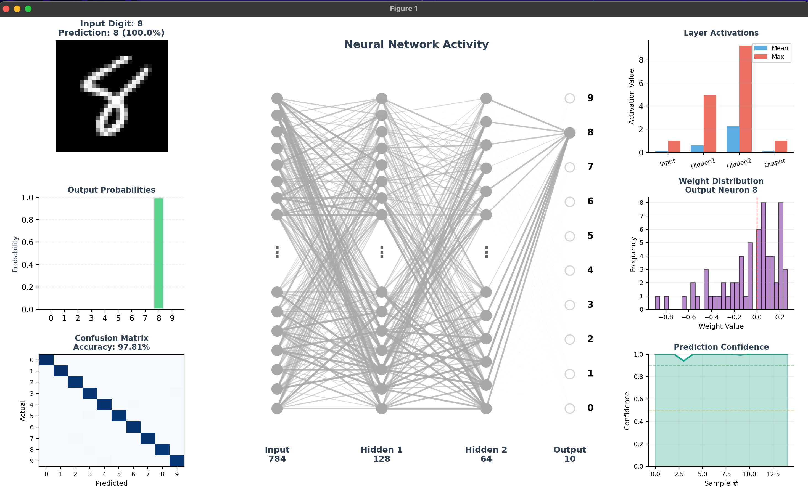

# Neural Network - MNIST Digit Classifier

A PyTorch-based neural network that learns to recognize handwritten digits (0-9) from the MNIST dataset, with real-time visualization of network activations.



## Table of Contents

-   [Overview](#overview)
-   [Project Structure](#project-structure)
-   [Installation](#installation)
-   [Usage](#usage)
-   [How Neural Networks Work (Simple Explanation)](#how-neural-networks-work-simple-explanation)
-   [The Mathematics Behind Neural Networks](#the-mathematics-behind-neural-networks)
-   [Network Architecture](#network-architecture)
-   [Training Process](#training-process)
-   [Visualization Features](#visualization-features)

---

## Overview

This project demonstrates a complete deep learning pipeline:

1. **Model Definition** - A 3-layer feedforward neural network
2. **Training** - Learning from 60,000 MNIST training images
3. **Visualization** - Real-time display of network activations and performance metrics

**Achieved Accuracy:** ~97-98% on MNIST test set

---

## Project Structure

```
neural-network/
├── models/
│   └── neural_network.py      # Network architecture definition
├── training/
│   └── train.py                # Training loop and optimization
├── visualization/
│   └── visualize_network.py    # Real-time network visualization
├── utils/
│   └── helpers.py              # Activation functions (sigmoid)
├── data/
│   └── MNIST/                  # Dataset (auto-downloaded)
├── imgs/
│   └── visualization_example.png  # Example visualization
├── main.py                     # Entry point
└── mnist_model.pth             # Trained model weights
```

---

## Installation

1. **Clone the repository:**

```bash
git clone https://github.com/yourusername/neural-network.git
cd neural-network
```

2. **Create and activate virtual environment:**

```bash
python3 -m venv venv
source venv/bin/activate
```

3. **Install dependencies:**

```bash
pip install -r requirements.txt
```

---

## Usage

**Train and visualize:**

```bash
python3 main.py
```

**Just train:**

```bash
python3 training/train.py
```

**Just visualize (requires trained model):**

```bash
python3 visualization/visualize_network.py
```

---

## How Neural Networks Work (Simple Explanation)

Think of a neural network as a smart decision making machine that learns from examples, just like how you learned to recognize numbers as a child.

### The Big Picture: Connecting the Dots

Imagine teaching a robot to recognize the number "7". You show it thousands of examples. The robot needs to figure out:

-   "What makes a 7 look like a 7"
-   "How is it different from a 1 or a 4"

A neural network does exactly this with **layers of decision makers** working together.

---

### Step 1: Breaking Down the Image

**What happens:** Your handwritten digit (a 28×28 pixel image) gets "unrolled" into a list of 784 numbers.

**Simple analogy:** Imagine a grid of 784 light bulbs. Each bulb can be bright (white pixel) or dim (black pixel). The brightness of each bulb is a number between 0 (black) and 1 (white).

```
Original: 28×28 image
Becomes:  [0.0, 0.2, 0.8, 0.9, 0.1, ... 784 numbers total]
```

---

### Step 2: Neurons "Fire" Based on Input

**What happens:** Each neuron looks at all 784 inputs and decides "how excited should I be"

**Simple analogy:** Think of a neuron as a friend giving advice. Each friend has:

1. **Opinions (weights)**: "I care a LOT about pixel 42, but pixel 100 doesn't matter to me"
2. **Bias**: "I'm generally an optimistic/pessimistic person"

The neuron combines all inputs based on these opinions:

```
Excitement = (Input1 × Opinion1) + (Input2 × Opinion2) + ... + Bias
```

**Example:**

```
Pixel 42 is very bright (0.9) and I care about it a lot (weight = 2.0)
Pixel 100 is dim (0.1) and I don't care (weight = 0.1)

My excitement = (0.9 × 2.0) + (0.1 × 0.1) + 0.5 = 1.8 + 0.01 + 0.5 = 2.31
```

---

### Step 3: The "Activation" Decision

**What happens:** The neuron asks: "Am I excited enough to pass this on"

**Simple analogy:** Like a light switch with a dimmer:

-   If excitement is negative >> Turn OFF (output = 0)
-   If excitement is positive >> Turn ON with that level of brightness

This is called **ReLU (Rectified Linear Unit)**:

```
If excitement is 2.31 >> Output is 2.31
If excitement is -0.5 >> Output is 0 (turned off)
```

**Why:** This prevents the network from passing negative/useless signals forward.

---

### Step 4: Layers Working Together

**What happens:** The network has 3 teams of neurons:

1. **Team 1 (128 neurons)**: "I detect edges, curves, and basic strokes"
2. **Team 2 (64 neurons)**: "I combine edges into shapes like loops and lines"
3. **Team 3 (10 neurons)**: "I decide which digit (0-9) this looks like"

**Simple analogy:** Like an assembly line:

-   **Worker 1**: "I see a vertical line"
-   **Worker 2**: "I see a curve at the top"
-   **Final Judge**: "Vertical line + curve at top = probably a 7"

Each team passes its "excitement" to the next team, building up understanding.

---

### Step 5: Making the Final Decision

**What happens:** The final 10 neurons each represent one digit (0-9). Their excitement levels become **probabilities**:

```
Neuron 0: 5%  confidence it's a "0"
Neuron 1: 2%  confidence it's a "1"
...
Neuron 7: 85% confidence it's a "7" << WINNER
...
Neuron 9: 3%  confidence it's a "9"

Total = 100%
```

The network picks the most confident answer: **7**

---

### Step 6: Learning from Mistakes

**What happens:** When the network makes a mistake, it adjusts its "opinions" (weights).

**Simple analogy:** Playing darts:

1. You throw and miss the bullseye
2. You see how far off you were (the "error")
3. You adjust your aim for next time

The network does the same:

1. It predicts "7" but the answer was "1" >> **BIG ERROR**
2. It calculates: "Which opinions caused this mistake"
3. It adjusts those opinions: "Next time, pay more attention to different features"

This process is called **backpropagation** (working backwards through layers).

---

### Step 7: Practicing Over and Over

**What happens:** The network sees 60,000 examples, adjusting after each one. It does this 25 times (25 "epochs").

**Simple analogy:** Like practicing piano:

-   **Day 1**: Terrible, hitting lots of wrong notes
-   **Day 10**: Getting better, fewer mistakes
-   **Day 25**: Playing smoothly

After 25 epochs:

```
Epoch 1:  45% accuracy (random guessing)
Epoch 5:  92% accuracy (learning patterns)
Epoch 25: 97-98% accuracy (expert level)
```

---

### Key Concepts Summarized

| Concept               | Simple Explanation                      | Real-World Analogy                  |
| --------------------- | --------------------------------------- | ----------------------------------- |
| **Neuron**            | A decision-maker that combines inputs   | A friend giving weighted advice     |
| **Weight**            | How much a neuron cares about an input  | Your opinion strength on a topic    |
| **Bias**              | A neuron's baseline excitement          | Your general optimism/pessimism     |
| **Activation (ReLU)** | Turning on/off based on excitement      | A light switch with dimmer          |
| **Layer**             | A team of neurons working together      | Workers on an assembly line         |
| **Forward Pass**      | Information flowing input >> output     | Following a recipe step by step     |
| **Loss**              | How wrong the prediction was            | Distance from dartboard bullseye    |
| **Backpropagation**   | Adjusting based on mistakes             | Correcting your aim after missing   |
| **Epoch**             | One full pass through all training data | Reading an entire textbook once     |
| **Learning Rate**     | How big each adjustment is              | How drastically you change your aim |

---

## The Mathematics Behind Neural Networks

### 1. Forward Propagation

For each layer, compute a linear transformation followed by non-linear activation.

**Layer Computation:**

```
z^(l) = W^(l) · a^(l-1) + b^(l)
a^(l) = σ(z^(l))
```

Where:

-   `a^(l-1)` = activations from previous layer
-   `W^(l)` = weight matrix
-   `b^(l)` = bias vector
-   `σ` = activation function

**For our 3-layer network:**

```
Layer 1: z^(1) = W^(1)·x + b^(1), a^(1) = ReLU(z^(1))
Layer 2: z^(2) = W^(2)·a^(1) + b^(2), a^(2) = ReLU(z^(2))
Layer 3: z^(3) = W^(3)·a^(2) + b^(3), ŷ = Softmax(z^(3))
```

---

### 2. Activation Functions

#### ReLU (Rectified Linear Unit)

```
ReLU(x) = max(0, x)

Derivative: ReLU'(x) = 1 if x > 0, else 0
```

**Why ReLU:**

-   Fast computation
-   No vanishing gradient for positive values
-   Induces sparsity (~50% neurons zero)

#### Softmax (Output Layer)

```
Softmax(z)_i = e^(z_i) / Σ_j e^(z_j)
```

Converts logits to probabilities that sum to 1.

---

### 3. Loss Function: Cross-Entropy

```
L = -log(ŷ_c)
```

Where c is the correct class.

**Example:**

```
True label: 7
Prediction for class 7: 0.80
Loss = -log(0.80) = 0.223

If prediction was 0.99:
Loss = -log(0.99) = 0.010 (much better)
```

**Why Cross-Entropy:**

-   Penalizes confident wrong predictions heavily
-   Maintains large gradients when predictions are wrong
-   Works perfectly with softmax

---

### 4. Backpropagation

Working backwards through layers using the chain rule.

**Output layer:**

```
δ^(3) = ŷ - y
```

**Hidden layers:**

```
δ^(l) = ((W^(l+1))^T · δ^(l+1)) ⊙ ReLU'(z^(l))
```

**Parameter gradients:**

```
∂L/∂W^(l) = δ^(l) · (a^(l-1))^T
∂L/∂b^(l) = δ^(l)
```

---

### 5. Optimization: Adam

Adam adapts learning rate per parameter.

**Update Rule:**

```
m_t = β_1·m_(t-1) + (1-β_1)·g_t        (momentum)
v_t = β_2·v_(t-1) + (1-β_2)·g_t²       (variance)

θ_t = θ_(t-1) - α·m_t/(√v_t + ε)
```

**Hyperparameters:**

-   α = 0.001 (learning rate)
-   β_1 = 0.9 (momentum decay)
-   β_2 = 0.999 (variance decay)

**Why Adam:**

-   Adaptive learning rates per parameter
-   Combines momentum + RMSprop
-   Works well without tuning

---

### 6. Batch Processing

**Mini-Batch Gradient Descent:** Update after B samples (B=64 in our case)

```
θ << θ - α·(1/B)Σ_(i∈batch) ∇L_i(θ)
```

**Why batch size = 64:**

-   GPU efficient (parallel processing)
-   Stable gradients (not too noisy)
-   Good generalization (some noise helps)

---

## Network Architecture

```
Input Layer: 784 neurons (28×28 flattened image)
    >>
Hidden Layer 1: 128 neurons + ReLU
    Weights: 784 × 128 = 100,352 parameters
    Bias: 128 parameters
    >>
Hidden Layer 2: 64 neurons + ReLU
    Weights: 128 × 64 = 8,192 parameters
    Bias: 64 parameters
    >>
Output Layer: 10 neurons (digits 0-9)
    Weights: 64 × 10 = 640 parameters
    Bias: 10 parameters

Total Parameters: 109,386
```

**Parameter Calculation:**

```python
Layer 1: (784 × 128) + 128 = 100,480
Layer 2: (128 × 64)  + 64  = 8,256
Layer 3: (64 × 10)   + 10  = 650

Total: 109,386 learnable parameters
```

**Memory Footprint:**

```
Float32: 109,386 × 4 bytes = ~427 KB
```

---

## Training Process

### Epoch Explanation

**What is an Epoch:** One complete pass through all 60,000 training images.

**Per Epoch:**

```
Batches: 60,000 / 64 = 938 batches
Forward passes: 938
Backward passes: 938
Weight updates: 938
```

**Training Loop (25 epochs):**

```
Total forward passes: 25 × 938 = 23,450
Total samples seen: 25 × 60,000 = 1,500,000
Training time: ~2-5 minutes (depending on hardware)
```

### Loss Curve

```
Epoch 1:  Loss ~0.45  (Random initialization)
Epoch 5:  Loss ~0.12  (Learning patterns)
Epoch 10: Loss ~0.08  (Refining features)
Epoch 15: Loss ~0.06  (Fine-tuning)
Epoch 25: Loss ~0.04  (Converged)
```

---

## Visualization Features


The visualization shows 7 informative graphs that update in real-time as the network processes different digits:

### 1. Input Image (Top Left)

-   **Shows:** Current 28×28 grayscale digit being classified
-   **Displays:** True label and model's prediction with confidence percentage
-   **Example:** "Input Digit: 8, Prediction: 8 (100.0%)"

### 2. Output Probabilities (Middle Left)

-   **Shows:** Bar chart of probability for each digit (0-9)
-   **Green bar:** The digit the network predicts (highest probability)
-   **Blue bars:** All other digits
-   **Key insight:** All probabilities sum to 100%

### 3. Neural Network Activity (Center - Large)

-   **Shows:** Real-time visualization of the network's internal workings
-   **Gray neurons:** Currently active (firing)
-   **White neurons:** Inactive
-   **Gray connections:** Strong signal flow between neurons
-   **Light connections:** Weak or inactive pathways
-   **Three dots (⋮):** Indicates more neurons exist (showing subset of most active)
-   **Numbers on right (0-9):** Output layer showing which digit each neuron represents

**How to read it:**

-   Left column: Input layer (784 neurons, showing ~15 most active)
-   Middle columns: Hidden layers processing features
-   Right column: Output layer (all 10 digits visible)
-   Watch how signals flow from left to right as it "thinks"

### 4. Confusion Matrix (Bottom Left)

-   **Shows:** Overall model performance across all 10 digits
-   **Diagonal (dark blue):** Correct predictions
-   **Off-diagonal (lighter):** Errors and misclassifications
-   **Example:** If row 4, column 9 is highlighted, it means 4s are sometimes predicted as 9s
-   **Accuracy:** Displayed at top (typically ~97-98%)

### 5. Layer Activations (Top Right)

-   **Shows:** Average and maximum activation values in each layer
-   **Blue bars (Mean):** Average neuron excitement in that layer
-   **Red bars (Max):** Highest neuron excitement in that layer
-   **Key insight:** Shows how the signal transforms through the network

### 6. Weight Distribution (Middle Right)

-   **Shows:** Histogram of all weights connected to the predicted output neuron
-   **Purple bars:** Frequency of different weight values
-   **Red dashed line:** Zero point (separates positive from negative weights)
-   **Key insight:** Shows what the network "learned" for recognizing this specific digit

### 7. Confidence Over Time (Bottom Right)

-   **Shows:** Model's confidence level across the last 50 predictions
-   **Teal line:** Prediction confidence (how sure the model is)
-   **Green dashed line (90%):** High confidence threshold
-   **Orange dashed line (50%):** Uncertainty threshold
-   **Key insight:** Consistent high confidence = model is well-trained

---

## Performance Metrics

### Accuracy Calculation

```
Accuracy = (Correct Predictions) / (Total Predictions)

Example:
9,750 correct out of 10,000 test images
Accuracy = 9,750 / 10,000 = 0.975 = 97.5%
```

### Confusion Matrix Insights

Common errors:

-   4 ↔ 9 (similar curves)
-   3 ↔ 5 (similar shapes)
-   7 ↔ 1 (simple strokes)

Per-class accuracy:

```
Digit 0: ~99% (distinctive shape)
Digit 1: ~99% (simple vertical line)
Digit 8: ~96% (complex loops)
```

---

## Key Takeaways

### Why This Architecture Works

1. **Sufficient Capacity:** 109K parameters can model digit variations
2. **Non-linearity:** ReLU enables complex decision boundaries
3. **Hierarchical Learning:**
    - Layer 1: Edges and strokes
    - Layer 2: Curves and shapes
    - Layer 3: Complete digits

### Training Insights

1. **Batch Size (64):** Balances speed and stability
2. **Learning Rate (0.001):** Small enough to converge, large enough to be fast
3. **25 Epochs:** Sufficient for convergence without overfitting

### Visualization Value

1. **Activation Patterns:** See which neurons respond to which features
2. **Confidence Tracking:** Identify uncertain predictions
3. **Error Analysis:** Confusion matrix reveals systematic mistakes

---

## Further Improvements

**Potential Enhancements:**

1. **Convolutional Layers:** Better for spatial patterns
2. **Dropout:** Reduce overfitting
3. **Batch Normalization:** Faster training
4. **Data Augmentation:** Rotate/shift images for robustness
5. **Learning Rate Scheduling:** Decay over time

**Expected Results:**

-   CNN architecture: ~99.5% accuracy
-   Ensemble methods: ~99.7% accuracy

---

## Mathematical Notation Reference

```
Scalars:      a, b, α, β
Vectors:      x, y, z
Matrices:     W, X
Functions:    f(x), σ(x)
Derivatives:  ∂L/∂W, ∇L
Element-wise: ⊙
Matrix mult:  ·
Transpose:    Wᵀ
Sum:          Σ
```

---

## License

MIT License - Feel free to use for learning just like I made this to learn how Neural Networks work

---

## References

-   [PyTorch Documentation](https://pytorch.org/docs/)
-   [MNIST Database](http://yann.lecun.com/exdb/mnist/)
-   [Adam Optimizer Paper](https://arxiv.org/abs/1412.6980)
-   [Understanding Neural Networks](https://www.deeplearningbook.org/)
-   [Simple Youtube Explanation](https://www.youtube.com/playlist?list=PLZHQObOWTQDNU6R1_67000Dx_ZCJB-3pi)
